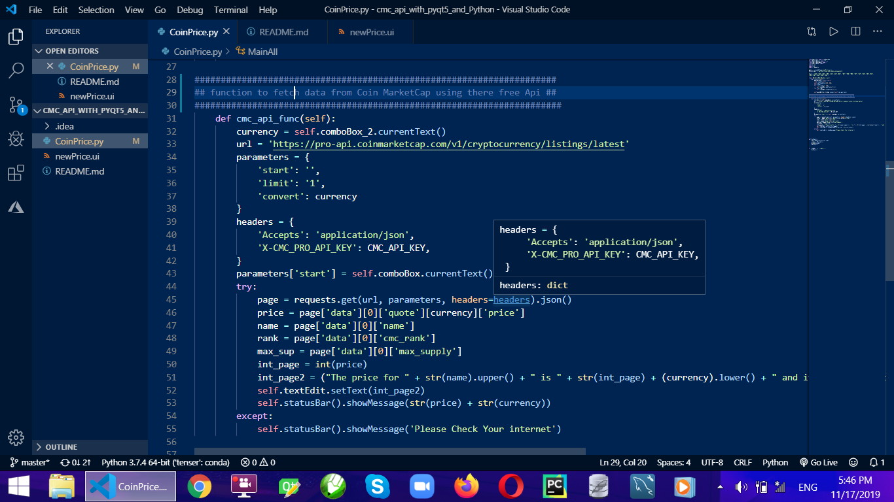
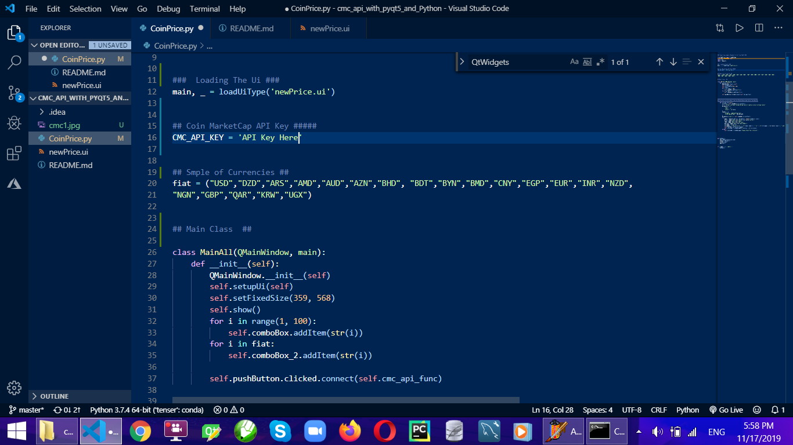
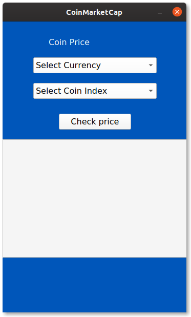
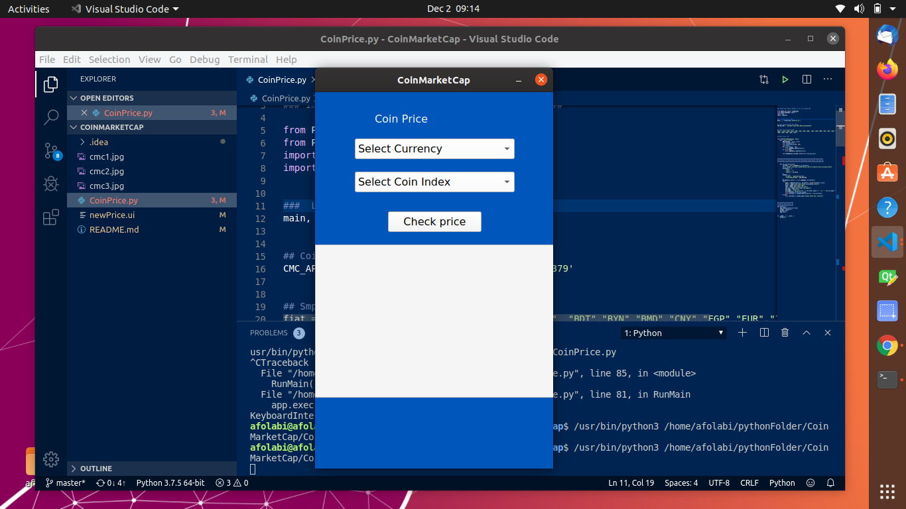
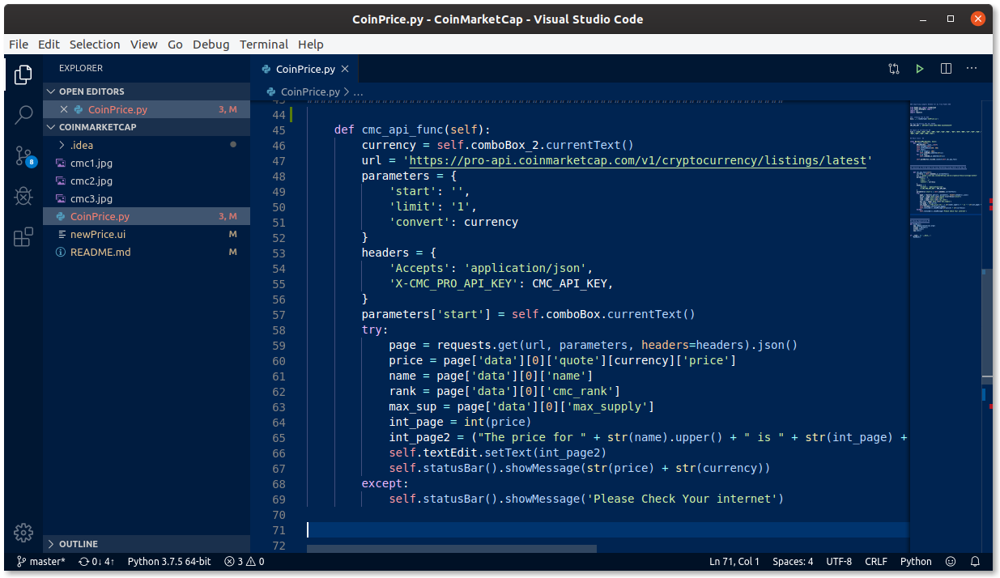
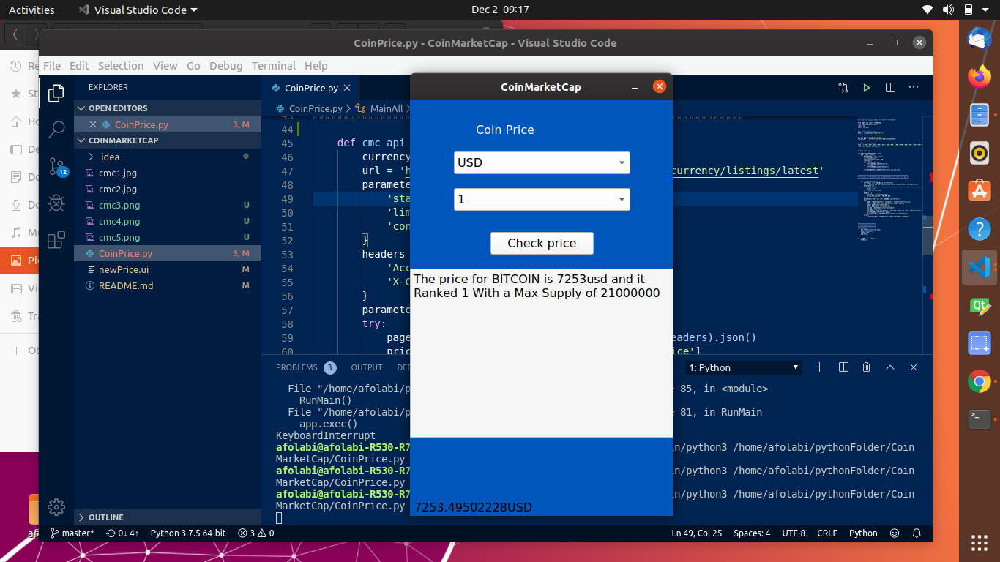
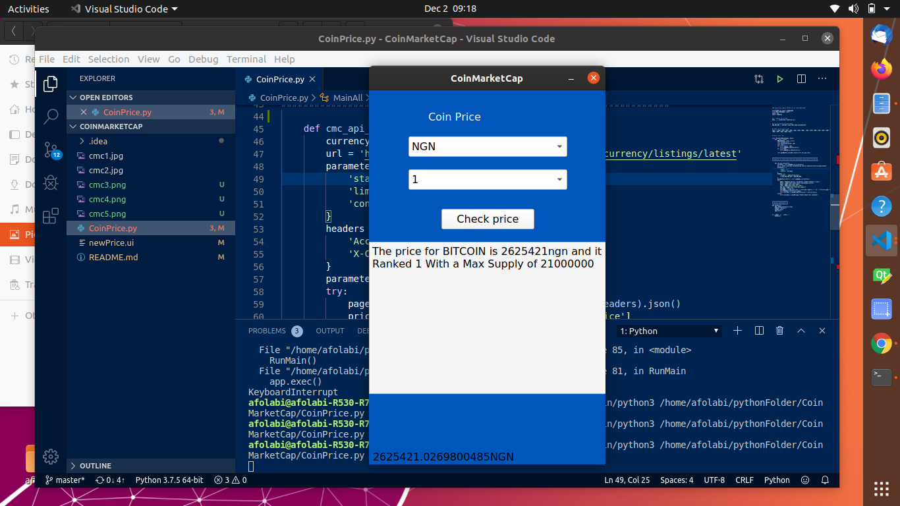

# Coin Price Update From CoinMarketCap
Get daily price update using cmc api
use cmc ranking numbers to get the current price, total supply circulating suppy.

# REQUIRMENT
pyqt5 install
python
Free Api from Coinmarketcap

# Screenshot 

---

---

---

---

---

---

# CONTACT INFO
- [PROFILE](https://github.com/garantor/)
---
- [LINKEDIN](https://www.linkedin.com/in/afolabisunday/)
